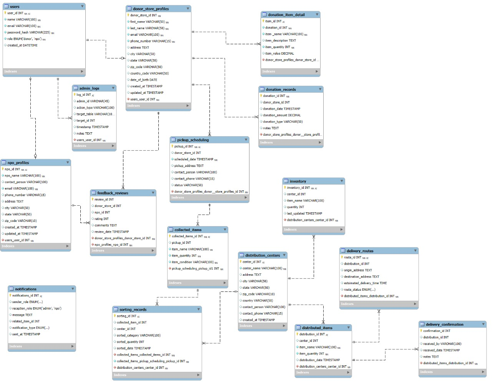

# Play It Forward – Supply Chain App

A web platform connecting donor stores and nonprofits to manage sports equipment donations.

## Features
- Log donations
- Schedule pickups
- Track deliveries
- Submit feedback

## Setup
1. Clone the repo
2. Run `npm install`
3. Start the server with `npm start`

## License
MIT

## ERD diagram


## Tables
1. users: Client information when logging on.
2. admin_logs: Administrator information.
3. npo_profiles: Information regarding NPO's.
4. feedback_reviews: Client ratings and feedback.
5. donor_store_profiles: Information regarding donors.
6. donation_item_detial: Information regarding donated items.
7. donation_records: Previouse donations made.
8. pickup_scheduling: Logistics information regarding pickup.
9. collected_items: Items collected from stores.
10. inventory: Items stored in inventory.
11. distribution_centres: Information regarding distribution centres.
12. sorting_records: Category item is sorted in. 
13. delivery_routes: Information regarding transport routes.
14. distributed_items: Information regarding delivered items. 
15. delivery_confirmation: Confirming completed delivery.
16. notifications: Client communication.

## Sample Data
The database includes sample data for testing:

1. Five different users with unique:
    user_id, name, email, password, and role.
2. Two NPO profiles with details such as:
    npo_id, npo_name, contact_person, email, phone_number, address, city, state, zip_code, and country.
3. Three donation records containing:
    donation_id, donor_store_id, donation_amount, donation_type, and notes.
4. Two donation item details specifying:
    item_id, donation_id, item_name, item_description, item_quantity, and item_value.
5. One pickup scheduling record with:
    pickup_id, donor_store_id, scheduled_date, pickup_address, contact_person, and contact_phone.
6. Two collected items including:
    collected_item_id, pickup_id, item_name, item_quantity, and item_condition.
7. One distribution center defined by:
    center_id, center_name, address, city, state, zip_code, country, contact_person, and contact_phone.
8. Two sorting records showing:
    sorting_id, collected_item_id, center_id, sorted_category, and sorted_quantity.
9. Two inventory entries with:
    inventory_id, center_id, item_name, and quantity.
10. Two distributed items tracking:
    distribution_id, center_id, item_name, and item_quantity.
11. Two delivery confirmations including:
    confirmation_id, distribution_id, received_by, and notes.
12. Two feedback reviews containing:
    review_id, donor_store_id, npo_id, rating, and comments.
13. Two notifications defined by:
    notification_id, sender_role, recipient_role, message, related_item_id, and notification_type.
14. Two admin logs with:
    log_id, admin_id, action_type, target_table, target_id, and notes.

## File Structure

```
├── index.html              # Main dashboard
├── login.html              # Vendor login page
├── register.html           # Vendor registration page
├── schedule-pickup.html    # Schedule pickup for donated items
├── donation.sql            # Database schema and sample data
├── donation_management.db  # SQLite database (created after running setup)
└── readme.md               # This file

## Usage

1. Initialize the database using the SQLite command line method above
2. Open `index.html` in your web browser
3. Navigate through the different pages to manage your inventory

## Technologies Used

- **HTML5**: Structure and forms
- **Bootstrap 5.3.8**: UI framework and styling
- **Bootstrap Icons**: Icon set
- **SQLite**: Database for data persistence

## Browser Compatibility

The application works with all modern browsers that support HTML5 and CSS3, including:

Chrome 90+
Firefox 88+
Safari 14+
Edge 90+
Note: This is a static HTML application. For production use, you would need to add backend functionality for database connectivity and form processing.

